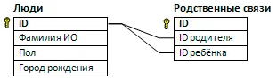

# labrab  

В двух файлах `people.csv` и `refs.csv` фрагмент базы данных «Родственники».  

- Таблица «Люди» содержит записи о людях в формате:  
- > id_человека;город_рождения  

- Таблица «Связи» содержит информацию о родительских связях:  
- > ID_родителя;ID_ребенка  

Более полная Схема данных выглядит так:  
  

Но для текущей задачи некоторые поля, не влияющие на решение, из таблиц были удалены.  

Напишите программу, которая определит количество людей, родившихся в том же городе, что и хотя бы один из их родителей.  

---  
