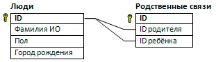

# labrab  

В двух файлах `people.csv` и `refs.csv` фрагмент базы данных «Родственники».  

- Таблица «Люди» содержит записи о людях в формате:  
- > id_человека;город_рождения  

- Таблица «Связи» содержит информацию о родительских связях:  
- > ID_родителя;ID_ребенка  

Более полная Схема данных выглядит так:  
  

Но для текущей задачи некоторые поля, не влияющие на решение, из таблиц были удалены.  

Напишите программу, которая определит количество людей, родившихся в том же городе, что и хотя бы один из их родителей.  

---  

Решение с помощью SQLite:  

```sql
-- PRAGMA foreign_keys = ON;

-- SELECT refs.idChild, people.cityName 
-- FROM refs JOIN people
-- WHERE refs.idChild = people.idPerson
-- 486

-- SELECT DISTINCT refs.idChild, people.cityName 
-- FROM refs JOIN people
-- WHERE refs.idChild = people.idPerson
-- 341

-- SELECT count(DISTINCT refs.idChild) as cnt
-- FROM refs JOIN people
-- WHERE refs.idChild = people.idPerson
-- 341

-- SELECT DISTINCT people.cityName
-- FROM refs JOIN people
-- WHERE refs.idChild = people.idPerson
-- ORDER BY people.cityName
-- 10

-- SELECT count(DISTINCT people.cityName) as cnt
-- FROM refs JOIN people
-- WHERE refs.idChild = people.idPerson
-- 10 - города детей

-- SELECT count(DISTINCT people.cityName) as cnt
-- FROM refs JOIN people
-- WHERE refs.idParent = people.idPerson
-- 10 - города родителей

-- 

-- SELECT refs.idChild, people.cityName 
-- FROM refs
-- JOIN people ON refs.idChild = people.idPerson

-- SELECT refs.idParent, p1.cityName, refs.idChild, p2.cityName
-- FROM refs
-- JOIN people as p1 ON refs.idParent = p1.idPerson
-- JOIN people as p2 ON refs.idChild = p2.idPerson

-- SELECT refs.idParent, refs.idChild
-- FROM refs
-- JOIN people AS p1 ON refs.idParent = p1.idPerson
-- JOIN people AS p2 ON refs.idChild = p2.idPerson
-- WHERE p1.cityName = p2.cityName;

-- SELECT DISTINCT refs.idChild
-- FROM refs
-- 	JOIN people AS p1 ON refs.idParent = p1.idPerson
-- 	JOIN people AS p2 ON refs.idChild = p2.idPerson
-- 		WHERE p1.cityName = p2.cityName;

SELECT count(DISTINCT refs.idChild) as cnt 
FROM refs
JOIN people AS p1 ON refs.idParent = p1.idPerson
JOIN people AS p2 ON refs.idChild = p2.idPerson
WHERE p1.cityName = p2.cityName;
```	

Индексация полей записи.  
При работе с большими объёмами данных запросы на пересечение связанных таблиц могут работать медленно.  
В этом случае для повышения производительности запроса рекомендуется создать индексы на столбцах idParent, idChild в таблице refs и на столбце idPerson в таблице people:  

```sql
CREATE INDEX idx_refs_idParent ON refs (idParent);
CREATE INDEX idx_refs_idChild ON refs (idChild);
CREATE INDEX idx_people_idPerson ON people (idPerson);
```
